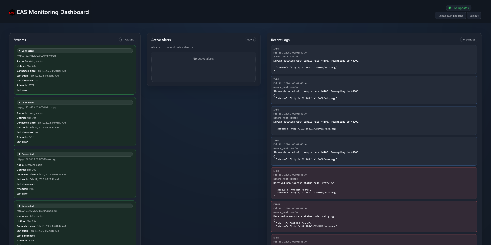

# Rust EAS Listener and Notifier

*A software ENDEC that listens to broadcast audio streams, decodes EAS/SAME messages, records audio, and pushes rich notifications via Apprise with a real-time monitoring dashboard. Also supports Make Your Own DASDEC, relaying to Icecast, and event/FIPS-code based filtering.*

---

---

## Features

- Real-time EAS/SAME message decoding from multiple audio sources (primarily Icecast/Shoutcast streams)
- Includes 1050Hz tone detection for NWR streams that are not SAME-toned
- Audio recording and optional Icecast relaying
- Rich notifications via [Apprise](https://github.com/caronc/apprise) and Discord embed support
- Web-based monitoring dashboard
- [Make Your Own DASDEC](https://github.com/playsamay4/MYOD) support
- Event-code based filtering
- Docker image with everything pre-configured and included
- Highly configurable via JSON
- Modular and extensible architecture
- Written in Rust for ultimate performance and memory safety

---

## Installation, configuration, usage, technical details

[Please refer to the wiki](https://github.com/wagwan-piffting-blud/EAS_Listener/wiki) for detailed instructions on installation, configuration, usage, and more that this README cannot cover in-depth.

---

## License

This project is licensed under the **GNU GPL-3.0** (see [`LICENSE`](LICENSE)).

---

## Acknowledgments
- SAME decoders and EAS/NWR community research
- Rust ecosystem maintainers

## GenAI Disclosure Notice: Portions of this repository have been generated using Generative AI tools (ChatGPT, ChatGPT Codex, GitHub Copilot).
