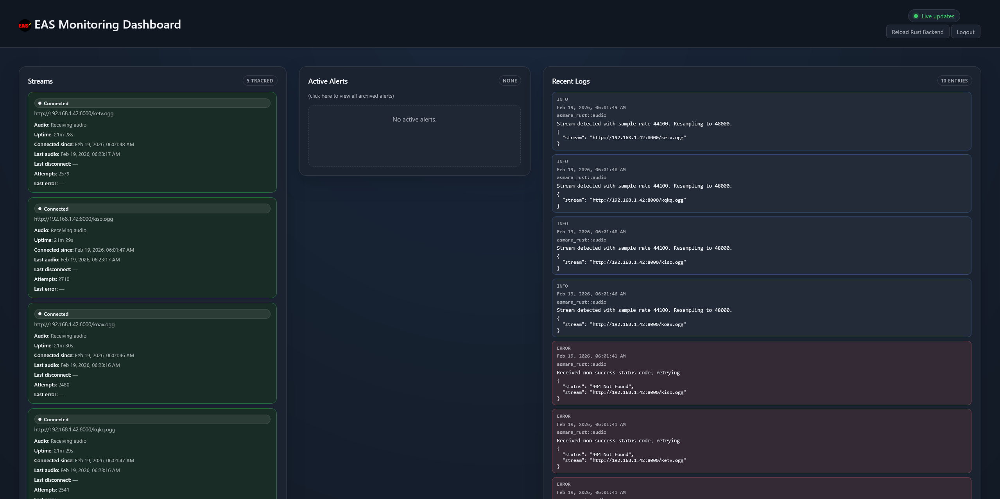

# Rust EAS Listener and Notifier

*A software ENDEC that listens to broadcast audio streams, decodes EAS/SAME messages, records audio, and pushes rich notifications via Apprise with a real-time monitoring dashboard. Also supports Make Your Own DASDEC, relaying to Icecast, and event/FIPS-code based filtering.*

---



---

## The `-lite` image is deprecated

**`ghcr.io/wagwan-piffting-blud/eas-listener:latest-lite` will stop being published after v0.32.0.** There is now a single unified image that covers both use cases.

Historically `latest` shipped Speechify Tom and `latest-lite` shipped Piper, because Speechify dragged in a large dependency tree. After pruning a pile of packages that were installed but never invoked (Liquidsoap, p7zip, tmux, gnupg2, wget, and six unused PHP extensions), the two images ended up roughly the same size — the Piper voice model alone is larger than the entire Speechify payload. Keeping two near-identical Dockerfiles in sync stopped being worth it.

**To migrate, change one line in your `docker-compose.yml`:**

```yaml
image: ghcr.io/wagwan-piffting-blud/eas-listener:latest
```

Then, if you want to keep using Piper, set the engine explicitly in your `config.json` (or `.env`):

```json
"TTS_ENGINE": "piper"
```

If you do not set `TTS_ENGINE`, the container picks one at startup based on what the image actually contains: Speechify Tom where it is available, Piper everywhere else. Nothing silently breaks — if you ask for an engine the image does not have, the entrypoint logs a warning, falls back to Piper, and the dashboard shows a banner explaining what happened.

Running the deprecated `-lite` tag also raises a banner on the dashboard and a warning in the container logs until you migrate.

---

## Supported architectures

| Platform | Speechify Tom | Piper | espeak-ng | Typical hardware |
| --- | --- | --- | --- | --- |
| `linux/amd64` | ✅ | ✅ | ✅ | x86-64 servers, NAS, mini PCs |
| `linux/arm64` | ✅ | ✅ | ✅ | Raspberry Pi 4/5 (64-bit OS), Apple silicon |
| `linux/arm/v7` | ✅ | ✅ | ✅ | Raspberry Pi 2/3, 32-bit Pi OS |

ARM support is new as of v0.32.0 — `latest` is now a multi-arch manifest, so ARM hosts pull the right image automatically with no config change.

**Every engine is available on every platform.** Speechify release 2026.07.22 ships native `x86_64`, `arm64`, and `armv7` Linux builds, and all of them — plus the legacy 32-bit `x86` build — synthesize *byte-identical* audio. A Raspberry Pi 2 and an x86-64 server produce the same WAV, sample for sample, so there is no voice drift between deployments.

amd64 now uses the native `x86_64` build rather than the legacy 32-bit one, so the image no longer enables i386 multiarch at all.

---

## Features

- Real-time EAS/SAME message decoding from multiple audio sources (primarily Icecast/Shoutcast streams)
- Includes 1050Hz tone detection for NWR streams that are not SAME-toned
- Optional CAP alert processing with TTS support for CAP alerts that don't have SAME headers (e.g. NWR/IPAWS CAP alerts)
- Configurable TTS word replacements for CAP alerts to improve readability and pronunciation **(NOTE: does NOT support phoneme codes or SSML tags, only simple word/phrase replacements!)**
- Audio recording and optional Icecast relaying
- Rich notifications via [Apprise](https://github.com/caronc/apprise) and Discord embed support
- Web-based monitoring dashboard
- [Make Your Own DASDEC](https://github.com/wagwan-piffting-blud/MYOD/tree/cross-platform-with-audio) support
- Event-code based filtering
- Docker image with everything pre-configured and included
- Highly configurable via JSON
- Modular and extensible architecture
- Written in Rust for ultimate performance and memory safety

---

## Installation, configuration, usage, technical details

[Please refer to the wiki](https://github.com/wagwan-piffting-blud/EAS_Listener/wiki) for detailed instructions on installation, configuration, usage, and more that this README cannot cover in-depth.

---

## Versioning

This project uses [Semantic Versioning](https://semver.org/). The dashboard will check for updates on GitHub and notify users when a new version is available. Patch versions are for bug fixes and minor improvements to the frontend, minor versions are for new features or bug fixes to the backend, and major versions are mostly unused (per Rust ecosystem tradition). Please refer to the project's commit history for detailed changes and updates.

---

## License

This project is licensed under the **GNU GPL-3.0** (see [`LICENSE`](LICENSE)).

---

## Acknowledgments
- [\@\_spchalethorpe09\_](https://sterlingvaspc.neocities.org/) and [\@aimaismog](https://github.com/aimaismog) on Discord for thorough testing, feedback, and suggestions
- Global Weather and EAS Society (GWES) for their overall support and resources
- SAME decoders and EAS/NWR community research
- Rust ecosystem maintainers

## GenAI Disclosure Notice: Portions of this repository have been generated using Generative AI tools (ChatGPT, ChatGPT Codex, GitHub Copilot).
